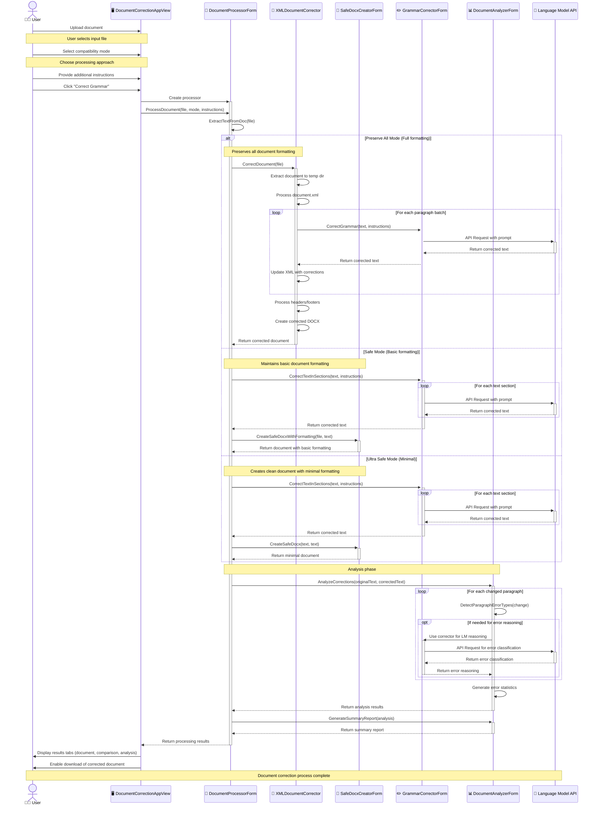

# Doc AI


> An intelligent document processing tool that corrects grammar in text documents while preserving the original formatting.

## 📝 Overview

Doc AI optimizes document quality by correcting grammatical errors while maintaining full formatting integrity. Compatible with DOCX, DOC, and TXT formats, it automatically identifies issues and implements superior word selections. The solution generates comprehensive analytical reports of corrections, enabling enterprises to produce impeccable documentation without sacrificing structural or visual elements—enhancing both efficiency and professional presentation.

**Access the application:** [Doc AI Application](https://docai.streamlit.app/)

## ✨ Key Features

- **Grammar Correction with Format Preservation**
  - Accurately corrects grammar errors while maintaining document structure
  - Preserves tables, images, headers, footers, and styling in DOCX files
  - Maintains paragraph formatting, lists, and other structural elements

- **Multiple Compatibility Modes**
  - **Preserve All**: Maintains all document elements including XML structure
  - **Safe Mode**: Balances formatting preservation with compatibility
  - **Ultra Safe Mode**: Creates clean document with perfect compatibility

- **Detailed Error Analysis**
  - Identifies grammar errors (punctuation, capitalization, etc.)
  - Generates visual reports showing error distribution
  - Provides detailed paragraph-by-paragraph correction explanations

- **Custom Correction Instructions**
  - Allows users to specify correction style (academic, technical, casual)
  - Supports preservation of domain-specific terminology
  - Enables custom handling of contractions, formal language, etc.

- **Interactive User Interface**
  - Streamlined Streamlit interface with real-time processing updates
  - Side-by-side comparison of original and corrected text
  - Multiple result views with downloadable reports

## 🔍 How It Works

The application processes documents through a sophisticated pipeline that preserves formatting while correcting grammar:


## 💻 Technical Architecture

The application is built with a modular architecture that separates concerns and promotes maintainability:


## 🛠️ Installation

```bash
# Clone the repository
git clone https://github.com/company-name/DocAI.git
cd DocAI

# Create and activate virtual environment (optional but recommended)
python -m venv venv
source venv/bin/activate  # On Windows: venv\Scripts\activate

# Install dependencies
pip install -r requirements.txt
```

## 📋 Requirements

The application requires the following dependencies:

```
streamlit==1.29.0
python-docx==0.8.11
pandas==2.1.0
matplotlib==3.7.2
plotly==5.15.0
lxml==4.9.3
requests==2.31.0
zipfile36==0.1.3
pathlib==1.0.1
```

## 🚀 Usage

```bash
# Start the application
streamlit run DocAI.py
```

Once running, access the application in your browser at `http://localhost:8501`.

### Using the Application

1. **Configure the Application:**
   - Set LM Studio API URL
   - Select model name
   - Adjust temperature for grammar correction

2. **Provide Additional Instructions (Optional):**
   - Specify academic style
   - Request preservation of technical terminology
   - Customize grammar correction style

3. **Choose Compatibility Mode:**
   - **Preserve All** - Maintain all formatting, tables, and images
   - **Safe Mode** - Balance formatting preservation with compatibility
   - **Ultra Safe Mode** - Create a completely new document with perfect compatibility

4. **Upload and Process Document:**
   - Upload your DOCX or DOC file
   - Click "Correct Grammar" to begin processing

5. **Review and Download Results:**
   - Download corrected document
   - Analyze error types with visual reports
   - View detailed correction report
   - Download analysis report in Markdown format

## 🔄 Processing Flow

This sequence diagram shows the detailed flow of document processing:



## 🧩 Key Components

1. **DocxValidator** - Ensures document XML structure is valid and fixes issues
2. **XMLDocumentCorrector** - Preserves formatting by correcting text within XML structure
3. **GrammarCorrectorForm** - Handles communication with the language model
4. **DocumentAnalyzerForm** - Analyzes and categorizes grammar corrections
5. **DocumentProcessorForm** - Orchestrates the document processing workflow
6. **DocumentCorrectionAppView** - Manages the Streamlit UI

## 📊 Error Analysis

The application performs comprehensive error analysis on the corrections:


## 🌐 Grammar Correction Process

The application uses language models to correct grammar while preserving meaning and style:


## 📸 Application Screenshots

<details>
<summary>Click to view screenshots</summary>

### Upload Interface


### Download Results


### Text Comparison


### Detailed Correction Report


### Error Analysis Dashboard

</details>

## 📖 License

This project is licensed under the MIT License - see the LICENSE file for details.

## 🙏 Acknowledgements

- Grammar correction is powered by LM Studio and supports various language models
- Document processing utilizes python-docx and lxml for XML manipulation
- Visualization components use Plotly and Matplotlib

## 👤 Contact Information

- Author: [Srinivas K M](https://github.com/srini1812)
- Email: 1812srini@gmail.com
